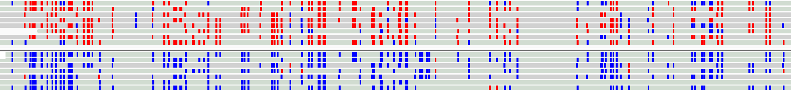

NanoMethPhase
=============
**Phase long reads and CpG methylations from Oxford Nanopore Technologies**  
  


Table of Contents
=================

* **[Installation](https://github.com/vahidAK/NanoMethPhase/blob/master/README.md#installation)**
  * [Using pip](https://github.com/vahidAK/NanoMethPhase#using-pip)
  * [Using docker](https://github.com/vahidAK/NanoMethPhase#using-docker)
  * [From source](https://github.com/vahidAK/NanoMethPhase#from-source)
* **[NanoMethPhase Modules](https://github.com/vahidAK/NanoMethPhase/blob/master/README.md#nanomethphase-modules)**
  * [methyl_call_processor](https://github.com/vahidAK/NanoMethPhase/blob/master/README.md#methyl_call_processor)
  * [phase](https://github.com/vahidAK/NanoMethPhase/blob/master/README.md#phase)
  * [dma](https://github.com/vahidAK/NanoMethPhase/blob/master/README.md#dma)
  * [bam2bis](https://github.com/vahidAK/NanoMethPhase/blob/master/README.md#bam2bis)
* **[Quickstart](https://github.com/vahidAK/NanoMethPhase/blob/master/README.md#quickstart)**
* **[Full Tutorial](https://github.com/vahidAK/NanoMethPhase/blob/master/README.md#full-tutorial)**
  * [Methylation Calling](https://github.com/vahidAK/NanoMethPhase/blob/master/README.md#1--methylation-calling)
  * [Variant Calling](https://github.com/vahidAK/NanoMethPhase/blob/master/README.md#2--variant-calling)
  * [SNV Phasing](https://github.com/vahidAK/NanoMethPhase/blob/master/README.md#3--phasing-of-detected-snvs)
  * [Detecting Haplotype Methylome](https://github.com/vahidAK/NanoMethPhase/blob/master/README.md#4--detecting-haplotype-methylome)  
* **[Example](https://github.com/vahidAK/NanoMethPhase/blob/master/README.md#example)**
  
# Installation
**NOTE:** We recommend first making a dedicated environment for NanoMethPhase with all dependencies in ```envs/environment.yaml``` file installed and then install NanoMethPhase using pip or use it by cloning the got repo and using it from source.  
You can make the conda and and install all dependencies by running these lines of codes:  
Creating a dedicated conda environment

Environment file available in the
[git repository](https://github.com/vahidAK/NanoMethPhase)

```
git clone https://github.com/vahidAK/NanoMethPhase.git
conda env create -f NanoMethPhase/envs/environment.yaml
```
## Using pip
Using [pypi repository](https://pypi.org/project/nanomethphase/)

```
pip install nanomethphase
```
## Using docker
Using [Docker image](https://hub.docker.com/r/jmgarant/nanomethphase)

It ships with complementary softwares SNVoter, Nanopolish, Clair, WhatsHap &
Tabix. **The container does not natively support interactive usage**, please
refer to the workaround below.

```bash
docker pull jmgarant/nanomethphase

# usage example:
docker run -t jmgarant/nanomethphase nanomethphase
docker run -t jmgarant/nanomethphase snvoter
docker run -t jmgarant/nanomethphase nanopolish
docker run -t jmgarant/nanomethphase clair
docker run -t jmgarant/nanomethphase whatshap
docker run -t jmgarant/nanomethphase tabix

# workaround for interactive use
docker run -it jmgarant/nanomethphase bash -il
```
## From source
From [source](https://github.com/vahidAK/NanoMethPhase.git)

```
git clone https://github.com/vahidAK/NanoMethPhase.git
cd NanoMethPhase
./nanomethphase.py
```
# NanoMethPhase Modules
## methyl_call_processor: 
Preparing methylation call file for methylation phasing or conversion of a bam file to whole genome bisulfite sequencing format for visualization in IGV.  
```
usage: nanomethphase methyl_call_processor --MethylCallfile METHYLCALLFILE
                                           [-h]
                                           [--callThreshold CALLTHRESHOLD]
                                           [--motif MOTIF] [--threads THREADS]
                                           [--chunk_size CHUNK_SIZE]

Preparing methylation call file for methylation phasing. Extended usage:
nanomethphase methyl_call_processor -mc [FILE] | sort -k1,1 -k2,2n -k3,3n |
bgzip > [FILE].bed.gz && tabix -p bed [FILE].bed.gz

required arguments:
  --MethylCallfile METHYLCALLFILE, -mc METHYLCALLFILE
                        The path to the nanopolish methylation call file from.

optional arguments:
  -h, --help            show this help message and exit
  --callThreshold CALLTHRESHOLD, -ct CALLTHRESHOLD
                        Quality threshold for considering a site as methylated
                        in methylation call file. Default is 2.0
  --motif MOTIF, -mf MOTIF
                        The motif you called methylation for (cpg), Currently
                        just cpg.
  --threads THREADS, -t THREADS
                        Number of parallel processes
  --chunk_size CHUNK_SIZE, -cs CHUNK_SIZE
                        Number of reads send to each proccessor. Default is
                        100
```  
## phase:  
Phasing reads and CpG Methylation data to the coresponding haplotypes.  
```
usage: nanomethphase phase --bam BAM --output OUTPUT [--vcf VCF]
                           [--per_read PER_READ] [--reference REFERENCE]
                           [--methylcallfile METHYLCALLFILE] [-h]
                           [--outformat OUTFORMAT] [--window WINDOW]
                           [--motif MOTIF] [--hapratio HAPRATIO]
                           [--min_base_quality MIN_BASE_QUALITY]
                           [--average_base_quality AVERAGE_BASE_QUALITY]
                           [--mapping_quality MAPPING_QUALITY]
                           [--min_SNV MIN_SNV] [--threads THREADS]
                           [--chunk_size CHUNK_SIZE] [--include_supplementary]
                           [--overwrite]

Phasing reads and Methylation

required arguments:
  --bam BAM, -b BAM     The path to the cordinate sorted bam file.
  --output OUTPUT, -o OUTPUT
                        The path to directory and prefix to save files. e.g
                        path/to/directory/prefix

one of these two are required arguments:
  --vcf VCF, -v VCF     The path to the whatshap phased vcf file or if it is
                        your second try and you have per read info file from
                        the first try there is no need to give vcf file,
                        instead give the path to the per read info file using
                        --per_read option which will be significantly faster.
                        If you give both vcf and per read file, per read file
                        will be ignored
  --per_read PER_READ, -pr PER_READ
                        If it is your second try and you have per read info
                        file from the first try there is no need to give vcf
                        file, instead give the path to the per read info file.
                        This will be significantly faster.

conditional required arguments based on selected output format(s):
  --reference REFERENCE, -r REFERENCE
                        The path to the reference file in case you selected
                        bam2bis output format. Fasta file must be already
                        indexed using samtools faidx.
  --methylcallfile METHYLCALLFILE, -mc METHYLCALLFILE
                        If you want to phase methyl call file (methycall
                        output format) to also calculate methylation frequency
                        for each haplotype give the path to the bgziped
                        methylation call file from methyl_call_processor
                        Module.

optional arguments:
  -h, --help            show this help message and exit
  --outformat OUTFORMAT, -of OUTFORMAT
                        What type of output you want (bam,bam2bis,methylcall).
                        Default is bam2bis,methylcall.bam: outputs phased
                        reads to seperate bam files.bam2bis: outputs phased
                        reads to seperate bam files converted to bisulfite bam
                        format for visualisation in IGV.methylcall: outputs
                        phased methylcall and methylation frequency files for
                        seperate haplotypes. You can select any format and
                        multiple or all of them seperated by comma.NOTE: if
                        you select bam2bis and/or methylcall, you must provide
                        input methylcall.bed.gz file from
                        methyl_call_processor module.
  --window WINDOW, -w WINDOW
                        if you want to only phase read for a region or
                        chromosome. You must insert region like this chr1 or
                        chr1:1000-100000.
  --motif MOTIF, -mt MOTIF
                        The motif you called methylation for (cpg), Currently
                        just cpg.
  --hapratio HAPRATIO, -hr1 HAPRATIO
                        0-1 .The threshold ratio between haplotype to tag as
                        H1 or H2. Default is <= 0.7
  --min_base_quality MIN_BASE_QUALITY, -mbq MIN_BASE_QUALITY
                        Only include bases with phred score higher or equal
                        than this option. Default is >=7.
  --average_base_quality AVERAGE_BASE_QUALITY, -abq AVERAGE_BASE_QUALITY
                        Base quality that SNVs tagged to a haplotype shoud
                        have compare to the other haplotype. When the average
                        base quality of SNVs mapped to two haplotype for one
                        read is equal or decision cannot be made Base on
                        Average bq (e.g. when 10 SNVs of HP1 mapped to a read
                        with average quality of 30, but only one SNV from HP2
                        mapped to the same read with bq=35) Then, instead of
                        quality count number of SNVs with quality more than
                        average_base_quality. Default is >=20.
  --mapping_quality MAPPING_QUALITY, -mq MAPPING_QUALITY
                        An integer value to specify thereshold for filtering
                        reads based om mapping quality. Default is >=20
  --min_SNV MIN_SNV, -ms MIN_SNV
                        minimum number of phased SNVs must a read have to be
                        phased. Default= 2
  --threads THREADS, -t THREADS
                        Number of parallel processes
  --chunk_size CHUNK_SIZE, -cs CHUNK_SIZE
                        Number of reads send to each proccessor. Default is
                        100
  --include_supplementary, -is
                        Also include supplementary reads
  --overwrite, -ow      If output files exist overwrite them
```  
## dma:
To perform differential Methylation analysis for two group comparison. To detect differentially methylated regions between haplotypes.  
```
usage: nanomethphase dma --case CASE --control CONTROL --out_dir OUT_DIR
                         --out_prefix OUT_PREFIX [-h] [--columns COLUMNS]
                         [--Rscript RSCRIPT] [--script_file SCRIPT_FILE]
                         [--coverage COVERAGE] [--dis_merge DIS_MERGE]
                         [--minlen MINLEN] [--minCG MINCG]
                         [--smoothing_span SMOOTHING_SPAN]
                         [--smoothing_flag SMOOTHING_FLAG]
                         [--equal_disp EQUAL_DISP] [--pval_cutoff PVAL_CUTOFF]
                         [--delta_cutoff DELTA_CUTOFF] [--pct_sig PCT_SIG]
                         [--overwrite]

Differential Methylation analysis for two group only (to find DMRs using
phased frequency results) using DSS R package.

required arguments:
  --case CASE, -ca CASE
                        The path to the tab delimited input methylation
                        frequency or ready input case file(s). If multiple
                        files, files must be in the same directory and enter
                        them comma seperates (e.g. file1,file2,file3)
  --control CONTROL, -co CONTROL
                        The path to the tab delimited input methylation
                        frequency or ready input control file(s). If multiple
                        files, files must be in the same directory and enter
                        them comma seperates (e.g. file1,file2,file3)
  --out_dir OUT_DIR, -o OUT_DIR
                        The path to the output directory
  --out_prefix OUT_PREFIX, -op OUT_PREFIX
                        The prefix for the output files

optional arguments:
  -h, --help            show this help message and exit
  --columns COLUMNS, -c COLUMNS
                        Comma seperated Columns in the methylation frequency
                        files that include the following information,
                        respectively: chromosome start strand coverage
                        methylation_frequency. If the methylation frequency
                        file does not have strand level information then just
                        enter columns number for chromosome start coverage
                        methylation_frequency. Default is that your input
                        files are already in a format required by DSS so you
                        do not need to select any column. If you giving as
                        input NanoMethPhase frequency files select
                        this:--columns 1,2,4,5,7
  --Rscript RSCRIPT, -rs RSCRIPT
                        The path to a particular instance of Rscript to use
  --script_file SCRIPT_FILE, -sf SCRIPT_FILE
                        The path to the DSS_DMA.R script file
  --coverage COVERAGE, -cov COVERAGE
                        Coverage cutoff. Default is >=1. It is recommended
                        that do not filter for coverage as DSS R package will
                        take care of it.
  --dis_merge DIS_MERGE, -dm DIS_MERGE
                        When two DMRs are very close to each other and the
                        distance (in bps) is less than this number, they will
                        be merged into one. Default is 1500 bps.
  --minlen MINLEN, -ml MINLEN
                        Minimum length (in basepairs) required for DMR.
                        Default is 100 bps.
  --minCG MINCG, -mcg MINCG
                        Minimum number of CpG sites required for DMR. Default
                        is 15.
  --smoothing_span SMOOTHING_SPAN, -sms SMOOTHING_SPAN
                        The size of smoothing window, in basepairs. Default is
                        500.
  --smoothing_flag SMOOTHING_FLAG, -smf SMOOTHING_FLAG
                        TRUE/FALSE. The size of smoothing window, in
                        basepairs. Default is TRUE. We recommend to use
                        smoothing=TRUE for whole-genome BS-seq data, and
                        smoothing=FALSE for sparser data such like from RRBS
                        or hydroxyl-methylation data (TAB-seq). If there is
                        not biological replicate, smoothing=TRUE is required.
                        Default is TRUE
  --equal_disp EQUAL_DISP, -ed EQUAL_DISP
                        TRUE/FALSE. When there is no biological replicate in
                        one or both treatment groups, users can either (1)
                        specify equal.disp=TRUE, which assumes both groups
                        have the same dispersion, then the data from two
                        groups are combined and used as replicates to estimate
                        dispersion; or (2) specify smoothing=TRUE, which uses
                        the smoothed means (methylation levels) to estimate
                        dispersions via a shrinkage estimator. This smoothing
                        procedure uses data from neighboring CpG sites as
                        "pseudo-replicate" for estimating biological variance.
                        Default is FALSE
  --pval_cutoff PVAL_CUTOFF, -pvc PVAL_CUTOFF
                        A threshold of p-values for calling DMR. Loci with
                        p-values less than this threshold will be picked and
                        joint to form the DMRs. See 'details' for more
                        information. Default is 0.001
  --delta_cutoff DELTA_CUTOFF, -dc DELTA_CUTOFF
                        A threshold for defining DMR. In DML detection
                        procedure, a hypothesis test that the two groups means
                        are equal is conducted at each CpG site. Here if
                        'delta' is specified, the function will compute the
                        posterior probability that the difference of the means
                        are greater than delta, and then construct DMR based
                        on that. This only works when the test results are
                        from 'DMLtest', which is for two-group comparison.
                        Default is 0
  --pct_sig PCT_SIG, -pct PCT_SIG
                        In all DMRs, the percentage of CG sites with
                        significant p-values (less than p.threshold) must be
                        greater than this threshold. Default is 0.5. This is
                        mainly used for correcting the effects of merging of
                        nearby DMRs.
  --overwrite, -ow      If output files exist overwrite them
```  
## bam2bis:
Convert a bam file to a mock whole-genome bisulfite sequencing format for visualization in IGV.  
```
usage: nanomethphase bam2bis --bam BAM --reference REFERENCE --methylcallfile
                             METHYLCALLFILE --output OUTPUT [-h]
                             [--window WINDOW] [--motif MOTIF]
                             [--mapping_quality MAPPING_QUALITY]
                             [--methylation] [--threads THREADS]
                             [--chunk_size CHUNK_SIZE]
                             [--include_supplementary] [--overwrite]

Convert a bam file to a bisulfite format for nice visualization in IGV

required arguments:
  --bam BAM, -b BAM     The path to the cordinate sorted bam file.
  --reference REFERENCE, -r REFERENCE
                        The path to the reference file. Fasta file must be
                        already indexed using samtools faidx.
  --methylcallfile METHYLCALLFILE, -mc METHYLCALLFILE
                        The path to the the bgziped and indexed methylation
                        call file from methyl_call_processor Module.
  --output OUTPUT, -o OUTPUT
                        The path to the output directory and desired prefix.

optional arguments:
  -h, --help            show this help message and exit
  --window WINDOW, -w WINDOW
                        if you want to only convert reads for a region or
                        chromosome. You must insert region like this chr1 or
                        chr1:1000-100000.
  --motif MOTIF, -mt MOTIF
                        The motif you called methylation for (cpg), Currently
                        just cpg.
  --mapping_quality MAPPING_QUALITY, -mq MAPPING_QUALITY
                        An integer value to specify thereshold for filtering
                        reads based om mapping quality. Default is >=20
  --methylation, -met   Output methylation call and frequency for converted
                        reads.
  --threads THREADS, -t THREADS
                        Number of parallel processes
  --chunk_size CHUNK_SIZE, -cs CHUNK_SIZE
                        Number of reads send to each proccessor. Default is
                        100
  --include_supplementary, -is
                        Also include supplementary reads
  --overwrite, -ow      If output files exist overwrite it
```  
# Quickstart

If you have your methylation call data and phased vcf file you can get the
haplotype methylome via:

1- Processing and indexing methylation call file

```
nanomethphase methyl_call_processor -mc MethylationCall.tsv -t 20 | sort -k1,1 -k2,2n -k3,3n | bgzip > MethylationCall.bed.gz && tabix -p bed MethylationCall.bed.gz
```

2- Getting haplotype methylome:

```
nanomethphase  phase -mc MethylationCall.bed.gz -o Test_methylome -of bam,methylcall,bam2bis -b sorted.bam -r hg38.fa -v Phased.vcf -t 64
```

You can select 3 output options:

***bam***: output phased bam files

***methylcall***: this will output phased methylation call (MethylCall.tsv, read level data) and methylation frequency files (MethylFrequency.tsv, Aggregated methylations for each region. These files can be used to detect differentially methylated regions between haplotype using *dma* module.). The headers for methylation call files are as follow:

| **Shorten**   | **Description** |
| ------------: | ----------------------------------------------------------------- |
| chromosome    | Chromosome name.                                                  |
| start         | Zero-Based start position of CpG.                                 |
| end           | Zero-Based end position of CpG.                                   |
| strand        | Strand.                                                           |
| read_name     | Read ID.                                                          |
| log_lik_ratio | llr from nanopolish given to each CpG as being methylated or not. |

The headers for methylation frequency files are as follow:

| **Shorten**   | **Description** |
| ------------: | ---------------------------------------------------- |
| chromosome    | Chromosome name.                                     |
| start         | Zero-Based start position of CpG.                    |
| end           | Zero-Based end position of CpG.                      |
| strand        | Strand.                                              |
| NumOfAllCalls | Number of all called CpGs.                           |
| NumOfModCalls | Number of all CpGs that called as methylated.        |
| MethylFreq    | Methylation frequency (NumOfModCalls/NumOfAllCalls). |

***bam2bis***: output mock whole-genome bisulfite converted bam files which can be visualized in IGV.

# Full Tutorial

In order to get the phased methylome you also need the following third-party
software:

[Nanopolish](https://github.com/jts/nanopolish) : To call CpG methylation.

[Clair](https://github.com/HKU-BAL/Clair) or other variant callers: To call
variants for your sample. Alternatively, you might already have variant calling
data for example from Illumina sequencing.

[WhatsHap](https://github.com/whatshap/whatshap): To phase single nucleotide
variants.

## 1- Methylation Calling

### 1-1 indexing fastq file and fast5 files:

NOTE: Fastqs must be merged to a single file

```
nanopolish index -d /path/to/fast5s_directory/.fastq
```

### 1-2 Methylation calling for CpG from each read:

```
nanopolish call-methylation -t <number_of_threads> -q cpg -r /path/to/fastq_fromstep-1/fastq.fastq -b /path/to/sorted_and_indexed/bam.bam -g /path/to/reference.fa > /path/to/MethylationCall.tsv
```

For the full tutorial please refer to
[Nanopolish](https://github.com/jts/nanopolish) page on GitHub.

## 2- Variant Calling

We have used Clair to call variants. However, you may call variants with other
tools or your variant data may come from Illumina or other methods.

You can call variants for each chromosome using the following command and the
concatenate all files:

```
for i in chr{1..22} chrX chrY; do callVarBam --chkpnt_fn <path_to_model_file> --ref_fn <reference_genome.fa> --bam_fn <sorted_indexed.bam> --ctgName $i --sampleName <your_sample_name> --call_fn $i".vcf" --threshold 0.2 --samtools <path_to_executable_samtools_software> --pypy <path_to_executable_pypy > --threads <number_of_threads>
```

For the full tutorial please refer to [Clair](https://github.com/HKU-BAL/Clair)
page on GitHub.

After variant calling, you can select only SNVs which will be used for phasing:
```
awk '$4 != "." && $5 != "." && length($4) == 1 && length($5) == 1' && $6 > <the_variant_calling_quality_threshold> variants.vcf > HighQualitySNVs.vcf
```

If you are calling variants from low coverage nanopore data (<30x) using Clair, you can also use our other tool [SNVoter](https://github.com/vahidAK/SNVoter) to improve SNV detection.

## 3- Phasing of detected SNVs

If you have your SNVs data available you need to phase them using
[WhatsHap](https://github.com/whatshap/whatshap).

```
whatshap phase --ignore-read-groups --reference reference.fa -o HighQualitySNVs_whatshap_phased.vcf HighQualitySNVs.vcf sorted_indexed.bam
```

For the full tutorial please refer to
[WhatsHap](https://github.com/whatshap/whatshap) page on GitHub.

If you have Trio data (Father, Mother, Child) you can use the script
[Trio_To_PhaseVCF_4FemaleChild.sh](https://github.com/vahidAK/NanoMethPhase/tree/master/scripts)
or
[Trio_To_PhaseVCF_4MaleChild.sh](https://github.com/vahidAK/NanoMethPhase/tree/master/scripts)
script to make a mock phased vcf file and use it as input for NanoMethPhase.

## 4- Detecting Haplotype Methylome

### 4-1 First you need to phase process methylation call file from Nanopolish.

```
nanomethphase methyl_call_processor -mc MethylationCall.tsv -t 20 | sort -k1,1 -k2,2n -k3,3n | bgzip > MethylationCall.bed.gz && tabix -p bed MethylationCall.bed.gz
```

### 4-2 Getting haplotype methylome:

```
nanomethphase  phase -mc MethylationCall.bed.gz -o Test_methylome -of bam,methylcall,bam2bis -b sorted.bam -r hg38.fa -v Phased.vcf -t 64
```

If your are not using called SNVs from nanopore data, and they come from, for
example, short-read sequencing, we recommend using -mbq 0 in the above code.

You can select 3 output options:

***bam***: output phased bam files

***methylcall***: this will output phased methylation call (MethylCall.tsv, read level data) and methylation frequency files (MethylFrequency.tsv, Aggregated methylations for each region. These files can be used to detect differentially methylated regions between haplotype using *dma* module.). The headers for methylation call files are as follow:

| **Shorten**   | **Description** |
| ------------: | ----------------------------------------------------------------- |
| chromosome    | Chromosome name.                                                  |
| start         | Zero-Based start position of CpG.                                 |
| end           | Zero-Based end position of CpG.                                   |
| strand        | Strand.                                                           |
| read_name     | Read ID.                                                          |
| log_lik_ratio | llr from nanopolish given to each CpG as being methylated or not. |

The headers for methylation frequency files are as follow:

| **Shorten**   | **Description** |
| ------------: | ---------------------------------------------------- |
| chromosome    | Chromosome name.                                     |
| start         | Zero-Based start position of CpG.                    |
| end           | Zero-Based end position of CpG.                      |
| strand        | Strand.                                              |
| NumOfAllCalls | Number of all called CpGs.                           |
| NumOfModCalls | Number of all CpGs that called as methylated.        |
| MethylFreq    | Methylation frequency (NumOfModCalls/NumOfAllCalls). |

***bam2bis***: output mock whole-genome bisulfite converted bam files which can be visualized in IGV.

### 4-3 Differential Methylation Analysis:

```
nanomethphase dma -c 1,2,4,5,7 -ca <path to methylation frequency for haplotype1> -co <path to methylation frequency for haplotype2> -rs <path to executable Rscript> -o <output directory> -op <output Prefix>
```

We use [DSS](https://www.bioconductor.org/packages/release/bioc/html/DSS.html) R/Bioconductor package to call DMRs between haplotypes.
callDMR.txt is the main output you need that stores differentially methylated regions, callDML.txt is the output that stores differentialy methylated loci and DMLtest.txt is the output that stores statistical test results for all loci. For more documentation of output data refere to [DSS](https://www.bioconductor.org/packages/release/bioc/html/DSS.html) page.

# Example:
We have included an example data in the Example_Data folder which you can use for a quick detection of haplotype methylome on 1Mb of chr21.
