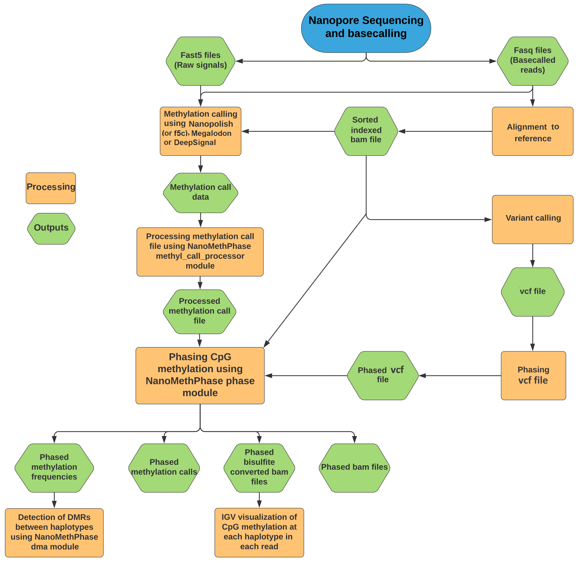

  
  
=============
**Phase long reads and CpG methylations from Oxford Nanopore Technologies**  
**Citation:** Akbari, V., Garant, JM., O'Neill, K. et al. Megabase-scale methylation phasing using nanopore long reads and NanoMethPhase. Genome Biol 22, 68 (2021).
Access [here](https://doi.org/10.1186/s13059-021-02283-5)  
  
Overall Workflow
=============


Table of Contents
=================

* **[Installation](https://github.com/vahidAK/NanoMethPhase/blob/master/README.md#installation)**
* **[NanoMethPhase Modules](https://github.com/vahidAK/NanoMethPhase/blob/master/README.md#nanomethphase-modules)**
  * [methyl_call_processor](https://github.com/vahidAK/NanoMethPhase/blob/master/README.md#methyl_call_processor)
  * [phase](https://github.com/vahidAK/NanoMethPhase/blob/master/README.md#phase)
  * [dma](https://github.com/vahidAK/NanoMethPhase/blob/master/README.md#dma)
  * [bam2bis](https://github.com/vahidAK/NanoMethPhase/blob/master/README.md#bam2bis)
* **[Full Tutorial](https://github.com/vahidAK/NanoMethPhase/blob/master/README.md#full-tutorial)**
  * [Methylation Calling](https://github.com/vahidAK/NanoMethPhase/blob/master/README.md#1--methylation-calling)
  * [Variant Calling](https://github.com/vahidAK/NanoMethPhase/blob/master/README.md#2--variant-calling)
  * [Phasing Detected Variants](https://github.com/vahidAK/NanoMethPhase/blob/master/README.md#3--phasing-of-detected-snvs)
  * [Detecting Haplotype Methylome](https://github.com/vahidAK/NanoMethPhase/blob/master/README.md#4--detecting-haplotype-methylome)  
* **[Example](https://github.com/vahidAK/NanoMethPhase/blob/master/README.md#example)**
  
# Installation 
This will clone the github repository and then installs NanoMethPhase depndencies in a conda environment named nanomethphase. Then you can run ```nanomethphase.py``` which is in the path you cloned the repository.  
```
git clone https://github.com/vahidAK/NanoMethPhase.git
cd NanoMethPhase
conda env create -f envs/environment.yaml
conda activate nanomethphase
python nanomethphase.py
```
You can also use other package management systems to create a virtual environment and install dependencies in the [environment.yaml](https://github.com/vahidAK/NanoMethPhase/blob/master/envs/environment.yaml) file or install them in your base environment and then use ```nanomethphase.py```  
# NanoMethPhase Modules
## methyl_call_processor: 
Preparing methylation call file for methylation phasing or conversion of a bam file to whole genome bisulfite sequencing format for visualization in IGV.  
```
usage: nanomethphase methyl_call_processor --MethylCallfile METHYLCALLFILE
                                           [-h]
                                           [--tool_and_callthresh TOOL_AND_CALLTHRESH]
                                           [--motif MOTIF] [--threads THREADS]
                                           [--chunk_size CHUNK_SIZE]

Preparing methylation call file for methylation phasing. Extended usage:
nanomethphase methyl_call_processor -mc [FILE] | sort -k1,1 -k2,2n -k3,3n |
bgzip > [FILE].bed.gz && tabix -p bed [FILE].bed.gz

required arguments:
  --MethylCallfile METHYLCALLFILE, -mc METHYLCALLFILE
                        The path to the per-read methylation call file.

optional arguments:
  -h, --help            show this help message and exit
  --tool_and_callthresh TOOL_AND_CALLTHRESH, -tc TOOL_AND_CALLTHRESH
                        Software you have used for methylation calling
                        (nanoplish, megalodon, deepsignal):methylation call
                        threshold for considering a site as methylated,
                        unmethylated or ambiguous in methylation call file.
                        Default is nanopolish:2 which is when methylation
                        calling performed by nanopolish and a CpG with llr >=
                        2 will be considered as methylated and llr <= -2 as
                        unmethylated, anything in between will be considered
                        as ambiguous call.For megalodon, call thresold will be
                        delta probability (prob_methylated -
                        prob_unmethylated) which is e^mod_log_prob - (1 -
                        e^mod_log_prob). For example, with a call threshold of
                        0.6 (0.8-0.2) CpGs between 0.8 and 0.2 probability
                        will be considered as ambiguous and >=0.8 as
                        methylated and <=0.2 as unmethylated. For deepsignal,
                        as for megalodon, this call threshold is delta
                        probability (prob_methylated -
                        prob_unmethylated).NOTE: Megalodon per-read text file
                        must be for only 5mC CpGs . Do not use per-read text
                        file where there are predictions for 2 or more
                        modifications (e.g. 5mC and 5hmC)
  --motif MOTIF, -mf MOTIF
                        The motif you called methylation for (cpg), Currently
                        just cpg.
  --threads THREADS, -t THREADS
                        Number of parallel processes. Default is 4
  --chunk_size CHUNK_SIZE, -cs CHUNK_SIZE
                        Number of reads send to each proccessor. Default is
                        100
```  
## phase:  
Phasing reads and CpG Methylation data to the coresponding haplotypes.  
```
usage: nanomethphase phase --bam BAM --vcf VCF --output OUTPUT
                           [--reference REFERENCE]
                           [--methylcallfile METHYLCALLFILE] [-h]
                           [--outformat OUTFORMAT] [--per_read PER_READ]
                           [--min_variant MIN_VARIANT] [--hapratio HAPRATIO]
                           [--mapping_quality MAPPING_QUALITY]
                           [--min_base_quality MIN_BASE_QUALITY]
                           [--average_base_quality AVERAGE_BASE_QUALITY]
                           [--include_indels] [--include_supplementary]
                           [--motif MOTIF] [--window WINDOW]
                           [--threads THREADS] [--chunk_size CHUNK_SIZE]
                           [--overwrite]

Phasing reads and Methylation

required arguments:
  --bam BAM, -b BAM     The path to the cordinate sorted bam file.
  --vcf VCF, -v VCF     The path to the phased vcf file.
  --output OUTPUT, -o OUTPUT
                        The path to directory and prefix to save files. e.g
                        path/to/directory/prefix

conditional required arguments based on selected output format(s):
  --reference REFERENCE, -r REFERENCE
                        The path to the reference file in case you selected
                        bam2bis output format. Fasta file must be already
                        indexed using samtools faidx.
  --methylcallfile METHYLCALLFILE, -mc METHYLCALLFILE
                        If you have selected methylcall or bam2bis output
                        format to phase methylation or make mock bisulfite
                        bams, give the path to the bgziped and indexed
                        methylation call file from methyl_call_processor
                        Module.

General optional arguments:
  -h, --help            show this help message and exit
  --outformat OUTFORMAT, -of OUTFORMAT
                        What type of output you want (bam,bam2bis,methylcall).
                        Default is bam2bis,methylcall. bam: outputs phased
                        reads to seperate bam files. bam2bis: outputs phased
                        reads to seperate bam files converted to bisulfite bam
                        format for visualisation in IGV. methylcall: outputs
                        phased methylcall and methylation frequency files for
                        seperate haplotypes. You can select any format and
                        multiple or all of them seperated by comma.
  --per_read PER_READ, -pr PER_READ
                        If it is your second try and you have per read info
                        file from the first try you can specify the per-read
                        file to make the process faster. This also enables you
                        to try different threshols of options (-mv, -mbq, -mq,
                        -hr, -abq), include/exclude indels, include/exclude
                        supp reads.
  --min_variant MIN_VARIANT, -mv MIN_VARIANT
                        minimum number of phased variants must a read have to
                        be phased. Default is 1
  --hapratio HAPRATIO, -hr HAPRATIO
                        0-1 .The maximum ratio (# of variants from one halotype
                        over the other) between haplotypes to tag as H1 or H2
                        (H2/H1 when #variants at H1 > H2 and H1/H2 when #variants at
                        H2 > H1). Default is 0.75
  --mapping_quality MAPPING_QUALITY, -mq MAPPING_QUALITY
                        An integer value to specify minimum read mapping
                        quality. Default is 20
  --min_base_quality MIN_BASE_QUALITY, -mbq MIN_BASE_QUALITY
                        Only include bases with this minimum base quality.
                        Default is 7.
  --average_base_quality AVERAGE_BASE_QUALITY, -abq AVERAGE_BASE_QUALITY
                        Minimum quality that variants tagged to a haplotype
                        should have compare to the other haplotype when
                        average of qualities is not informative. This will be
                        used when the average base quality of variants mapped
                        to two haplotypes for one read is not informative and
                        decision cannot be made (e.g. when 10 variants of HP1
                        mapped to a read with average quality of 30, but only
                        one variant from HP2 mapped to the same read with
                        bq=35). Then, instead of considering average of
                        qualities, the tool will count number of variants in
                        both haplotypes that meet the given
                        average_base_quality and uses the counts to make
                        decision. Default is 20.
  --include_indels, -ind
                        Also include indels for read phasing to haplotypes.
  --include_supplementary, -is
                        Also include supplementary reads
  --motif MOTIF, -mt MOTIF
                        The motif you called methylation for (cpg), Currently
                        just cpg.
  --window WINDOW, -w WINDOW
                        if you want to only phase read for a region or
                        chromosome. You must insert region like this chr1 or
                        chr1:1000-100000.
  --threads THREADS, -t THREADS
                        Number of parallel processes. Default is 4
  --chunk_size CHUNK_SIZE, -cs CHUNK_SIZE
                        Number of reads send to each proccessor. Default is
                        100
  --overwrite, -ow      If output files exist overwrite them
```  
## dma:
To perform differential Methylation analysis for two group comparison. It is a wrapper for DSS R package to detect differentially methylated regions between haplotypes.  
```
usage: nanomethphase dma --case CASE --control CONTROL --out_dir OUT_DIR
                         --out_prefix OUT_PREFIX [-h] [--columns COLUMNS]
                         [--coverage COVERAGE] [--Rscript RSCRIPT]
                         [--script_file SCRIPT_FILE] [--overwrite]
                         [--smoothing_span SMOOTHING_SPAN]
                         [--smoothing_flag SMOOTHING_FLAG]
                         [--equal_disp EQUAL_DISP] [--pval_cutoff PVAL_CUTOFF]
                         [--delta_cutoff DELTA_CUTOFF] [--minlen MINLEN]
                         [--minCG MINCG] [--pct_sig PCT_SIG]
                         [--dis_merge DIS_MERGE]

Differential Methylation analysis for two group only (to find DMRs using
phased frequency results) using DSS R package.

required arguments:
  --case CASE, -ca CASE
                        The path to the tab delimited input methylation
                        frequency or ready input case file(s) (First rwo is
                        header which will be ignored). If multiple files,
                        files must be in the same directory and give the path
                        to the directory.
  --control CONTROL, -co CONTROL
                        The path to the tab delimited input methylation
                        frequency or ready input control file(s) (First rwo is
                        header which will be ignored). If multiple files,
                        files must be in the same directory and give the path
                        to the directory.
  --out_dir OUT_DIR, -o OUT_DIR
                        The path to the output directory
  --out_prefix OUT_PREFIX, -op OUT_PREFIX
                        The prefix for the output files

General optional arguments.:
  -h, --help            show this help message and exit
  --columns COLUMNS, -c COLUMNS
                        Comma seperated Columns in the methylation frequency
                        files that include the following information,
                        respectively: chromosome start(CG_position) strand
                        coverage methylation_frequency. If the methylation
                        frequency file does not have strand level information
                        then just enter columns number for chromosome
                        start(CG_position) coverage
                        methylation_frequency. Default is that your input files
                        are already in a format required by DSS so you do not
                        need to select any column. If you are giving as input
                        NanoMethPhase frequency files select this: --columns
                        1,2,4,5,7. When strand column is given the assumption
                        is that negative strand positions are 1 bp greater
                        than positive strand, just like NanoMethPhase's
                        frequency outputs.
  --coverage COVERAGE, -cov COVERAGE
                        Minimum coverage cutoff. Default is 1. It is
                        recommended that do not filter for coverage as DSS R
                        package will take care of it. For strand-level inputs, 
                        this coverage is per-strand. When no --columns is 
                        given, coverage option is skipped.
  --Rscript RSCRIPT, -rs RSCRIPT
                        The path to a particular instance of Rscript to use.
  --script_file SCRIPT_FILE, -sf SCRIPT_FILE
                        The path to the DSS_DMA.R script file. By default the
                        script that was shipped during
                        nanomethphase installation will be used.
  --overwrite, -ow      If output files exist overwrite them.

optional arguments that will be used in DSS DMLtest function.:
  --smoothing_span SMOOTHING_SPAN, -sms SMOOTHING_SPAN
                        The size of smoothing window, in basepairs. Default is
                        500.
  --smoothing_flag SMOOTHING_FLAG, -smf SMOOTHING_FLAG
                        TRUE/FALSE. A flag to indicate whether to apply
                        smoothing in estimating mean methylation levels. It is
                        recommended to use smoothing TRUE for whole-genome BS-
                        seq data, and smoothing FALSE for sparser data such
                        like from RRBS or hydroxyl-methylation data (TAB-seq).
                        see -ed option and DSS R package details for more
                        information. Default is TRUE.
  --equal_disp EQUAL_DISP, -ed EQUAL_DISP
                        TRUE/FALSE. A flag to indicate whether the dispersion
                        in two groups are deemed equal or not. Default is
                        FALSE and the dispersion shrinkages are performed on
                        two conditions independently. More info on -ed and
                        -smf: When there is no biological replicate in one or
                        both treatment groups, users can either (1) specify
                        equal.disp TRUE, which assumes both groups have the
                        same dispersion, then the data from two groups are
                        combined and used as replicates to estimate
                        dispersion; or (2) specify smoothing TRUE, which uses
                        the smoothed means (methylation levels) to estimate
                        dispersions via a shrinkage estimator. This smoothing
                        procedure uses data from neighboring CpG sites as
                        "pseudo-replicate" for estimating biological variance.

optional arguments that will be used in DSS callDML and callDMR functions.:
  --pval_cutoff PVAL_CUTOFF, -pvc PVAL_CUTOFF
                        A threshold of p-values for calling DMLs and DMRs.
                        When delta is not specified, Loci with p-values less
                        than this threshold will be picked as DML and also
                        joint to form the DMRs. See DSS R package 'details'
                        for more information for this regarding DMLs and DMRs.
                        Default is 0.001.
  --delta_cutoff DELTA_CUTOFF, -dc DELTA_CUTOFF
                        A threshold for defining DMLs and DMRs. In DML
                        detection procedure, a hypothesis test that the two
                        groups means are equal is conducted at each CpG site.
                        Here if 'delta' is specified, the function will
                        compute the posterior probability that the difference
                        of the means are greater than delta, and then call DML
                        and construct DMR based on that. This only works when
                        the test results are from 'DMLtest', which is for two-
                        group comparison. See DSS R package for more
                        information. Default is 0.

optional arguments that will be used in DSS callDMR function.:
  --minlen MINLEN, -ml MINLEN
                        Minimum length (in basepairs) required for DMR.
                        Default is 100 bps.
  --minCG MINCG, -mcg MINCG
                        Minimum number of CpG sites required for DMR. Default
                        is 15.
  --pct_sig PCT_SIG, -pct PCT_SIG
                        In all DMRs, the percentage of CG sites with
                        significant p-values (less than p.threshold) must be
                        greater than this threshold. Default is 0.5. This is
                        mainly used for correcting the effects of merging of
                        nearby DMRs.
  --dis_merge DIS_MERGE, -dm DIS_MERGE
                        When two DMRs are very close to each other and the
                        distance (in bps) is less than this number, they will
                        be merged into one. Default is 100 bps. See dma
                        section notes for more details.
```  
## bam2bis:
Convert a bam file to a mock whole-genome bisulfite sequencing format for visualization in IGV. Note that the reads in the output bam from this module are not exactly the same as the reads in the input bam. In the output bam the sequence of the reads corresponds to the sequence from reference they mapped to and cytosine is also converted based on its methylation status.  
```
usage: nanomethphase bam2bis --bam BAM --reference REFERENCE --methylcallfile
                             METHYLCALLFILE --output OUTPUT [-h]
                             [--mapping_quality MAPPING_QUALITY]
                             [--motif MOTIF] [--methylation]
                             [--include_supplementary] [--window WINDOW]
                             [--threads THREADS] [--chunk_size CHUNK_SIZE]
                             [--overwrite]

Convert a bam file to a bisulfite format for nice visualization in IGV

required arguments:
  --bam BAM, -b BAM     The path to the cordinate sorted bam file.
  --reference REFERENCE, -r REFERENCE
                        The path to the reference file. Fasta file must be
                        already indexed using samtools faidx.
  --methylcallfile METHYLCALLFILE, -mc METHYLCALLFILE
                        The path to the the bgziped and indexed methylation
                        call file from methyl_call_processor Module.
  --output OUTPUT, -o OUTPUT
                        The path to the output directory and desired prefix.

optional arguments:
  -h, --help            show this help message and exit
  --mapping_quality MAPPING_QUALITY, -mq MAPPING_QUALITY
                        An integer value to specify minimum mapping quality of
                        the read. Default is 20
  --motif MOTIF, -mt MOTIF
                        The motif you called methylation for (cpg), Currently
                        just cpg.
  --methylation, -met   Output methylation call and frequency for converted
                        reads.
  --include_supplementary, -is
                        Also include supplementary reads
  --window WINDOW, -w WINDOW
                        if you want to only convert reads for a region or
                        chromosome. You must insert region like this chr1 or
                        chr1:1000-100000.
  --threads THREADS, -t THREADS
                        Number of parallel processes. Default is 4
  --chunk_size CHUNK_SIZE, -cs CHUNK_SIZE
                        Number of reads send to each proccessor. Default is
                        100
  --overwrite, -ow      If output files exist overwrite it
```  

# Full Tutorial

In order to get the phased methylome you also need the following third-party
software:

Nanopolish, f5c >=v0.7 (f5c is an optimised re-implementation of Nanopolish), Megalodon, or DeepSignal to call CpG methylation (More info regarding methylation callers provided at the end of tutorial.). Note that when NanoMethPhase phases methylation, it matches the read coordinates from methylcall file to the read coordinates from bam file. Therefore, the optimal results will be when the same bam used for methylation calling is used for NanoMethPhase phasing. This is the case for methylation callers such as nanopolsih and f5c because they need an input bam file to call methylation, so the same bam can be used for NanoMethPhase as well. Input bam file must contain base qualities as NanoMethPhase uses them during phasing.  

Clair3 or other variant callers to call variants for your sample. Alternatively, you might already have variant calling data for example from short-read sequencing.

WhatsHap to phase variants. You may use other phasing tools or phased vcf input, however the phase information for the phased heterozygous variants, that are used by NanoMethPhase, must be indicated by 0|1 or 1|0 in the start of 10th column of the vcf file.  

## 1- Methylation Calling
Here we use nanopolish

### 1-1 indexing fastq file and fast5 files:

NOTE: Fastqs must be merged to a single file

```
nanopolish index -d /path/to/fast5s_directory/ fastq.fastq
```

### 1-2 Methylation calling for CpG from each read:

```
nanopolish call-methylation -t <number_of_threads> -q cpg -r /path/to/fastq_fromstep-1/fastq.fastq -b /path/to/sorted_and_indexed/bam.bam -g /path/to/reference.fa > /path/to/MethylationCall.tsv
```

For the full tutorial please refer to
[Nanopolish](https://github.com/jts/nanopolish) page on GitHub.

## 2- Variant Calling
Here we use Clair3

```
run_clair3.sh --bam_fn=/path/to/Nanopore_aligned_reads.bam \
  --ref_fn=/path/to/reference.fa \
  --output=/path/to/output/directory \
  --threads=<# of threads> --platform=ont \
  --model_path=/path/to/model
```
After variant calling the results will be in merge_output.vcf.gz file in the output directory. You can further filter this file to keep PASS variants:  
```
gunzip -c /path/to/output/directory/merge_output.vcf.gz | awk '$1 ~ /^#/ || $7=="PASS"' > PassedVariants.vcf
```  
Or if you want to filter based on a quaity threshold
```
gunzip -c /path/to/output/directory/merge_output.vcf.gz | awk '$1 ~ /^#/ || $6 > <quality threshold>' > QualityFilteredVariants.vcf
```
## 3- Phasing Detected Variants
Here we use WhatsHap to phase variants

```
whatshap phase --ignore-read-groups --reference reference.fa -o whatshap_phased.vcf input.vcf sorted_indexed.bam
```
This wil only phase SNVs, to also phase indels you can add ```--indels ``` option:  
```
whatshap phase --ignore-read-groups --indels --reference reference.fa -o whatshap_phased.vcf input.vcf sorted_indexed.bam
```

For the full tutorial please refer to
[WhatsHap](https://github.com/whatshap/whatshap) page on GitHub.


**NOTE:** NanoMethPhase requires a single sample vcf file in which phase information for the het variants in the 10th column indicated by "|" (i.e. 0|1 or 1|0).  

## 4- Detecting Haplotype Methylome

### 4-1 First you need to process and index the methylation call file.

```
python nanomethphase.py methyl_call_processor -mc MethylationCall.tsv -t 20 | sort -k1,1 -k2,2n -k3,3n | bgzip > MethylationCall.bed.gz && tabix -p bed MethylationCall.bed.gz
```  
See nanomethphase methyl_call_processor help for more information and how to run it for other methylation callers.

### 4-2 Getting haplotype methylome:

```
python nanomethphase.py phase -b sorted.bam -v Phased.vcf -mc MethylationCall.bed.gz -r hg38.fa -o Test_methylome -of bam,methylcall,bam2bis -t 64
```  
You can select ```--include_indels``` option to also use indels during phasing.  
  
You can select 3 output options:

***bam***: output phased bam files

***methylcall***: this will output phased methylation call (MethylCall.tsv, read level data) and methylation frequency files (MethylFrequency.tsv, Aggregated methylations for each region. These files can be used to detect differentially methylated regions between haplotype using *dma* module.).  
The headers for methylation call files are as follow:

| **Shorten**      | **Description** |
| --------------:  | ----------------------------------------------------------------------------------|
| chromosome       | Chromosome name.                                                                  |
| start            | Start position of CpG.                                                            |
| end              | End position of CpG.                                                              |
| strand           | Strand.                                                                           |
| read_name        | Read ID.                                                                          |
| llr_Or_DeltaProb | llr for CpG from nanopolosh (Or delta prob in case of megalodon and deepsignal).  |  

CpG coordinates are zero-based here and coordinates from both strands are based on positive strand.  

The headers for methylation frequency files are as follow:

| **Shorten**   | **Description** |
| ------------: | ---------------------------------------------------- |
| chromosome    | Chromosome name.                                     |
| start         | Start position of CpG.                               |
| end           | End position of CpG.                                 |
| strand        | Strand.                                              |
| NumOfAllCalls | Number of all called CpGs.                           |
| NumOfModCalls | Number of all CpGs that called as methylated.        |
| MethylFreq    | Methylation frequency (NumOfModCalls/NumOfAllCalls). |  

CpG coordinates are zero-based here and coordinates of negative strand are 1 bp greater than the positive strand.  

**NOTE:** NanoMethPhase outputs strand-level frequency files to not lose strand information if you needed them. However, usually methlation information from both strands are aggregated for each CpG to have per-CpG methylation. If you want to aggregate the information from both strand, you need to aggregate number of all calls and number of methylated calls from both strands for each CpG and then calculate the new frequency for each CpG site. For example, following command aggregates data from both strands and calculates new methylation frequency for each CpG (You need to install [datamash](https://www.gnu.org/software/datamash/) before using this command):  

```
sed '1d' NanoMethPhase_HP1_MethylFrequency.tsv | awk -F'\t' '{if ($4=="-") {$2=$2-1;$3=$3-1}; print $1,$2,$3,$5,$6}' OFS='\t' | sort -k1,1 -k2,2n | datamash -g1,2,3 sum 4,5 | awk -F'\t' '{print $0,$5/$4}' OFS='\t' | sed '1i chromosome\tstart\tend\tNumOfAllCalls\tNumOfModCalls\tMethylFreq' > HP1_MethylFrequency.tsv
```
During DMA, dma module also aggregates all calls and methylated calls from both strands for each CpG ("ReadyForDSS" files) and then performs differential methylation analysis.  

***bam2bis***: output mock whole-genome bisulfite converted bam files which can be visualized in IGV. Note that the reads in the output bams are not exactly the same as the reads in the input bam. In the output bams the sequence of the reads corresponds to the sequence from reference they mapped to and cytosine is also converted based on its methylation status.  

**NOTE:** NanoMethPhase will also output a ***PerReadInfo.tsv*** file. This file includes the following information:  
  
| **Shorten**                       | **Description** |
| --------------------------------: | ----------------------------------------------------------------------------------------------------------------------- |
| chromosome                        | Chromosome that read mapped to.                                                                                         |
| ReadRefStart                      | Start position where the read mapped.                                                                                   |
| ReadRefEnd                        | End position where the read mapped.                                                                                     |
| ReadID                            | Read ID.                                                                                                                |
| strand                            | Strand.                                                                                                                 |
| ReadFlag:Is_Supplementary         | Bitwise flag of the read:If read is supplementary or not.                                                               |
| ReadLength:MappingQuality         | The length of mapped read:Mapping quality of the read.                                                                  |
| Position:BaseQuality:HP1_Variants | Position and Phred quality of bases from read at haplotype 1.                                                           |
| Position:BaseQuality:HP2_Variants | Position and Phred quality of bases from read at haplotype 2.                                                           |  

Base quality for indels represent the base quality of the first base. Coordinates are zero-based in per-read info file.
                       
Having this file allow you to use it along with the vcf file which improves the speed significantly for the next runs. This also allows you to try different thresholds of options (-mq, -mbq, -mv, -hr, -abq, -ind, -is). Note that per-read file from previous version **cannot** be used to run with different mapping quality or include/exclude supplementary reads.  
  
### 4-3 Differential Methylation Analysis:

```
python nanomethphase.py dma -c 1,2,4,5,7 -ca <path to methylation frequency for haplotype1> -co <path to methylation frequency for haplotype2> -o <output directory> -op <output Prefix>
```

We use [DSS](https://www.bioconductor.org/packages/release/bioc/html/DSS.html) R/Bioconductor package to call DMRs between haplotypes. -dm, -ml, -mcg, -sms, -smf, -ed, -pvc, -dc and -pct options and their help are from DSS R package and you can read DSS documentation for more information.
callDMR.txt is the main output you need that stores differentially methylated regions, callDML.txt is the output that stores differentialy methylated loci and DMLtest.txt is the output that stores statistical test results for all loci. For more documentation of output data refere to [DSS](https://www.bioconductor.org/packages/release/bioc/html/DSS.html) documentation page. During DMA, for inputs with methylation from both strands, such as HP1 and HP2 here, methylation information (number of all reads/calls and number of modified reads/calls) will be aggregated from both strands on the positive strand for each CpG site (stored in "ReadyForDSS" files. CpG position of negative strand converted to positive strand by subtracting 1). Therefore, the cordinates of the outputs are based on the positive strand.  
Note: You can refine your DMR list afterwars based on "diff.methy" column, which is the difference of average methylations from both comparisons, and/or areaStat. For list of DMLs, You can also use "diff" column that is difference of methylations from both comparisons to further refine your DML list. You may use other columns as well to further refine your results.  
Note: When dis_merge (dis.merge) is greater than minlen, current versions of DSS package just consider dis.merge equal to minlen. Therefore, the maximum dis.merge is minlen even if you selected a dis.merge greater than minlen (You can read issue #31 [here](https://github.com/haowulab/DSS/issues/31) for more info.).  

# Example:
We have included an example data in the Example_Data folder which you can use for a quick detection of haplotype methylome on 1Mb of chr21.  
If you want to try workflow from basecalling to methylation phasing we have included a subset of [NA12878 data](https://github.com/nanopore-wgs-consortium/NA12878/blob/master/Genome.md) (chr11:2600000-2800000) at [this link](https://www.bcgsc.ca/downloads/NanoMethPhase/test_data.tar.gz) which you can download and try.  
  
# More info about methylation callers
Output Per-read methylation call file from the current versions of methylation callers mentiond above (Nanopolish, f5c>=v0.7, Megalodon, and DeepSignal) are compatible with NanoMethPhase. Here are some more information about their output per-read methylation call file and compatibility with methyl_call_processor:  
nanopolish and f5c>=v0.7 produce the following columns and the CpG coordinates are zero-based and coordinates for both strands are based on positive strand (positions for the CpG from both strands are the same):
```
chromosome	strand	start	end	read_name	log_lik_ratio	log_lik_methylated	log_lik_unmethylated	num_calling_strands	num_motifs	sequence
chr2	+	200000365	200000365	50152360-5abb-4e1f-9ce0-c08a49d65b57	3.91	-142.10	-146.01	1	1	GTGAACGCTTT
chr2	+	200000776	200000776	50152360-5abb-4e1f-9ce0-c08a49d65b57	-20.59	-243.72	-223.13	1	1	TAACTCGATTT
chr2	-	200000365	200000365	607a605c-f01b-4b02-a8d5-b4c8adb88e6b	4.93	-257.29	-262.22	1	1	GTGAACGCTTT
chr2	-	200000776	200000776	607a605c-f01b-4b02-a8d5-b4c8adb88e6b	-11.09	-225.59	-214.50	1	1	TAACTCGATTT
```
Megalodon per-read text methylation call output has the following columns and CpG coordinates are zero-based and coordinates of negative strand are 1 bp greater than positive strand (The methylation call file must be only for methylation. Do not use per-read methylation file that has multiple modification calls, e.g. 5mC and 5hmC):
```
read_id	chrm	strand	pos	mod_log_prob	can_log_prob	mod_base
56780a98-ccb3-41a5-8ed1-fc069412fc13    chr11   +       21488565        -0.9126647710800171     -0.5132502558405262     m
56780a98-ccb3-41a5-8ed1-fc069412fc13    chr11   +       21486004        -0.8042076826095581     -0.5931974211226271     m
2cc45d27-6084-49f1-b156-34501adc7651    chr11   -       21488566        -3.271272659301758      -0.03869726232984402    m
2cc45d27-6084-49f1-b156-34501adc7651    chr11   -       21486005        -4.3451995849609375     -0.013053750265459633   m
```
DeepSignal methylation call file has the following columns and CpG coordinates are zero-based and coordinates of negative strand are 1 bp greater than the positive strand:
```
chrom   pos     strand  pos_in_strand   readname        read_strand     prob_0  prob_1  called_label    k_mer
chr11	2669073	+	-1	19b5bd8e-0a50-449d-8dc1-ea2dc4e2fe2b	t	0.09740365	0.90259635	1	TACCCTGCCGTATCAGT
chr11	2669107	+	-1	19b5bd8e-0a50-449d-8dc1-ea2dc4e2fe2b	t	0.13432296	0.865677	1	ACTGGCTACGTGTGGCT
chr11	2669074	-	-1	12652f63-7676-4ad8-b7bf-af1aec4b282d	t	0.13398732	0.8660127	1	CACTGATACGGCAGGGT
chr11	2669108	-	-1	12652f63-7676-4ad8-b7bf-af1aec4b282d	t	0.12144542	0.87855464	1	GAGCCACACGTAGCCAG
```  

